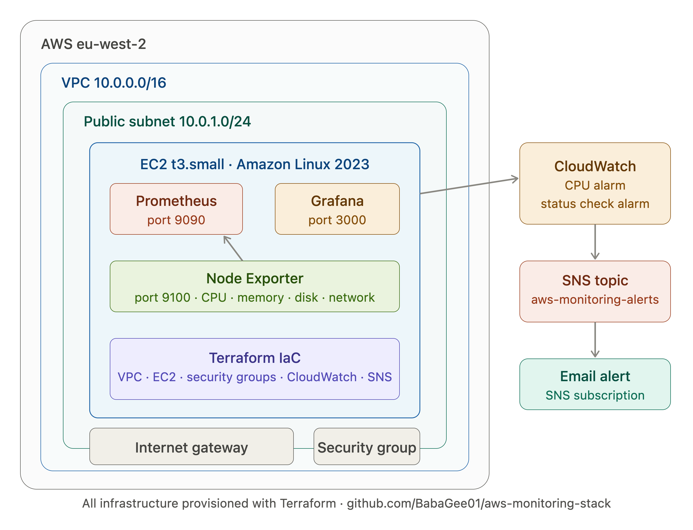
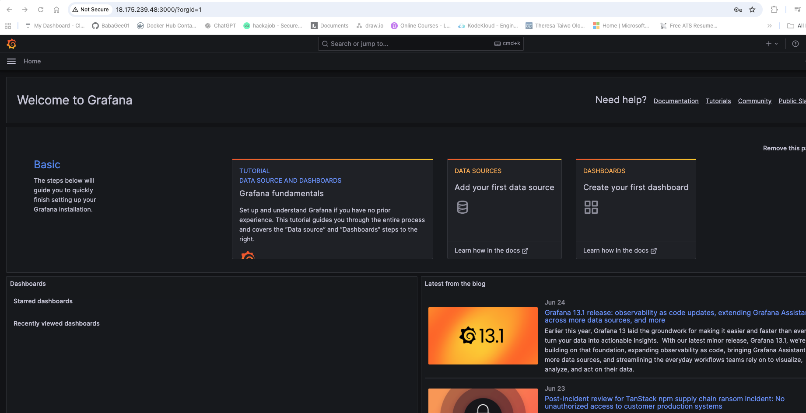
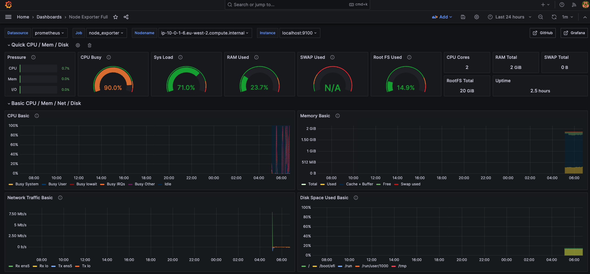
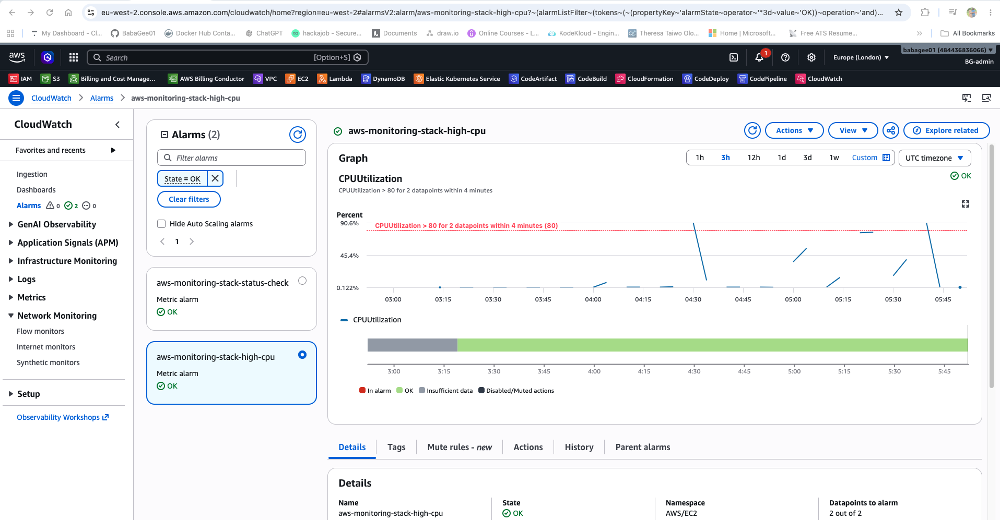

# AWS Monitoring Stack


A production-style cloud infrastructure monitoring platform provisioned entirely with Terraform on AWS. Demonstrates end-to-end observability using Prometheus, Grafana, Node Exporter, and CloudWatch with automated alerting via SNS.

## What It Does

- Provisions a full AWS environment (VPC, subnets, IGW, security groups, EC2) using modular Terraform
- Deploys Prometheus and Node Exporter to collect system metrics (CPU, memory, disk, network)
- Visualises live metrics in Grafana using the Node Exporter Full dashboard (ID 1860)
- Configures CloudWatch alarms with SNS email notifications for CPU threshold breaches
- All infrastructure managed as code — reproducible, version-controlled, and destroyable in one command

## Architecture



## Tech Stack

| Tool | Purpose |
|---|---|
| Terraform | Infrastructure provisioning (VPC, EC2, CloudWatch, SNS) |
| AWS EC2 | Hosts the monitoring stack |
| Prometheus | Metrics collection and storage |
| Node Exporter | Exposes EC2 system metrics to Prometheus |
| Grafana | Metrics visualisation and dashboards |
| CloudWatch | AWS-native monitoring and alarm management |
| SNS | Email alerting on threshold breaches |

## Screenshots

### Grafana — Node Exporter Full Dashboard (Live Metrics)


### Grafana — CPU Spike During Stress Test


### CloudWatch — CPU Utilisation Alarm


## Prerequisites

- AWS account with IAM user (programmatic access)
- Terraform >= 1.5
- AWS CLI configured (`aws configure`)
- An EC2 key pair created in eu-west-2

## Quick Start

```bash
# Clone the repo
git clone https://github.com/yourusername/aws-monitoring-stack.git
cd aws-monitoring-stack/terraform

# Initialise Terraform
terraform init

# Update terraform.tfvars with your values
# ami_id, key_name, my_ip, alert_email

# Preview changes
terraform plan

# Deploy
terraform apply
```

Access your stack:
- Prometheus: `http://<EC2_PUBLIC_IP>:9090`
- Grafana: `http://<EC2_PUBLIC_IP>:3000` (default: admin/admin)

## Project Structure

```
aws_monitoring_stack/
├── terraform/
│   ├── main.tf
│   ├── variables.tf
│   ├── outputs.tf
│   ├── terraform.tfvars        # Not committed — add your values
│   └── modules/
│       ├── vpc/                # VPC, subnet, IGW, route tables
│       ├── ec2/                # EC2 instance, security group, userdata
│       └── cloudwatch/         # Alarms, SNS topic, dashboard
├── docs/                       # Architecture diagram and screenshots
└── README.md
```

## Cleanup

Destroy all resources to avoid AWS charges:

```bash
cd terraform
terraform destroy
```

## Author

Jide Oloko — [LinkedIn](https://www.linkedin.com/in/jide-oloko-2a4bb588) | [Medium](https://medium.com/@sb.oloko) | [Project Portfolio](https://babagee01.github.io/)
